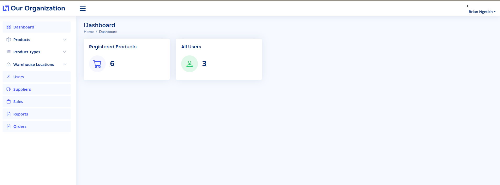
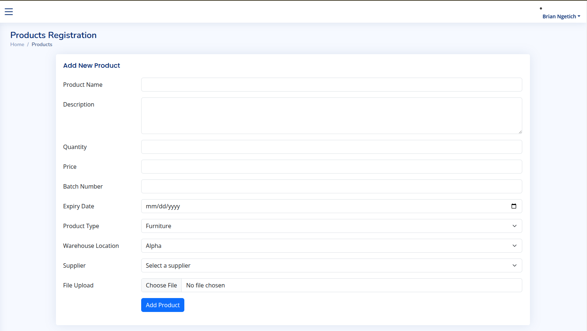
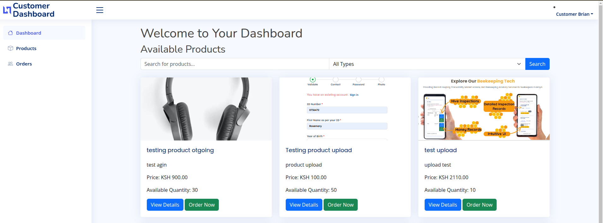

# Warehouse Management System

This is an Open Source Warehouse Management System built using **Laravel 11**. The system allows companies/supermarkets, and organizations to manage warehouse locations, products, suppliers, and more. 


Customers can also register and login, and place orders for various available products. 

## Features

- Manage warehouse locations (CRUD)
- Manage products (CRUD)
- Manage suppliers (CRUD)
- Admin dashboard for managing all entities
- Admin exports CSV reports

## Requirements

- PHP 8.3 or higher
- Composer
- Node.js and npm
- MySQL or any other supported database



## Getting Started

### 1. Clone the Repository

```bash
git clone
cd warehouse-management-system


composer install


npm install

npm run dev ----- Run this command everytime you launch the project. 

cp .env.example .env


APP_URL=http://localhost

DB_CONNECTION=mysql
DB_HOST=127.0.0.1
DB_PORT=3306
DB_DATABASE=your_database_name
DB_USERNAME=your_username
DB_PASSWORD=your_password


php artisan key:generate


php artisan migrate

php Storage link

php artisan serve


For Admin

Register
Login
change Admin role in DB 
Approve admin


Create Supplier
Create Product List
Create Warehouse Locations

Create Product

Approve users


Packages Used
- Laravel Excel


